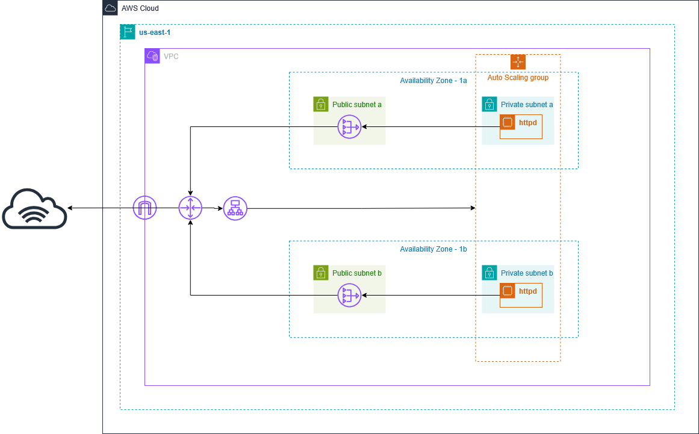

# 🌩️ AWS Highly Available and Scalable Web Infrastructure with Terraform
A **Terraform project** that deploys a **highly available and scalable web application infrastructure on AWS** with best practices for security, scalability, and high availability. It’s designed to demonstrate real-world **DevOps and Cloud Infrastructure automation** — including **networking, compute scaling, and load balancing** — built from scratch as infrastructure-as-code.

---

## 🏗️ Architecture Diagram



> *The architecture includes multi-AZ, public/private subnets, Application load balancer, NAT GW, and ASG EC2 instances.*

---

## 📋 Project Overview
This Terraform configuration sets up a complete **two-tier web application infrastructure** with:

- **VPC Architecture** — Multi-AZ VPC with public & private subnets
- **High Availability** — Resources spread across two availability zones  
- **Security** — Segregated network layers with security groups and least privilege  
- **Auto Scaling** — EC2 instances automatically scale based on demand  
- **Load Balancing** — Application Load Balancer (ALB) distributes traffic  
- **NAT Gateway** — Provides secure outbound internet access for private subnets  

---

## 🛠️ Technologies Used

### 🔹 Infrastructure as Code
- **Terraform** — Declarative infrastructure management

### 🔹 AWS Services
- **VPC & Networking:** Subnets, Route Tables, Internet Gateway, NAT Gateway  
- **Compute:** EC2 Instances via Launch Templates  
- **Scaling:** Auto Scaling Groups (min=2, max=4, desired=2)  
- **Load Balancing:** Application Load Balancer (ALB)  
- **Security:** Security Groups, Elastic IPs 
 
---

## 📁 Project Structure
```bash
terraform-aws-vpc-asg/
├── main.tf # Main infrastructure configuration
├── variables.tf # Variable definitions
├── outputs.tf # Output values
├── terraform.tfvars # Variable values (create your own copy)
├── terraform.tfvars.example # Example variables file
└── README.md # Project documentation

---

## 🚀 Deployment Instructions

1. **Initialize Terraform**
   terraform init

2. **Validate Configuration**
   terraform validate

3. **Preview Changes**
   terraform plan

4. **Deploy Infrastructure**
   terraform apply
